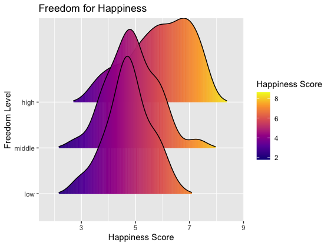
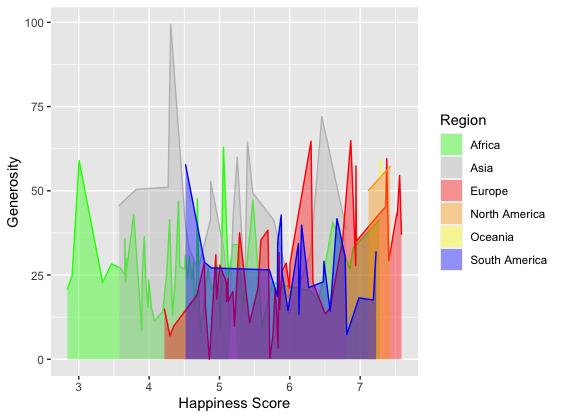

```{r setup, include=FALSE}
knitr::opts_chunk$set(echo = TRUE)
library(ggplot2)
library(Lock5Data)
library(plotly)
library(ggridges)
happiness = read.csv("2015.csv", header = TRUE, sep = ",")
happiness[happiness == "Western Europe"] <- "Europe"
happiness[happiness == "Central and Eastern Europe"] <- "Europe"
happiness[happiness == "Eastern Asia"] <- "Asia"
happiness[happiness == "Southeastern Asia"] <- "Asia"
happiness[happiness == "Southern Asia"] <- "Asia"
happiness[happiness == "Middle East and Northern Africa"] <- "Africa"
happiness[happiness == "Sub-Saharan Africa"] <- "Africa"
happiness[happiness == "Latin America and Caribbean"] <- "South America"
happiness[happiness == "Australia and New Zealand"] <- "Oceania"

Freedom.cat = cut(happiness$Freedom, breaks = c(-1, 0.3283, 0.4286, 0.7), labels = c("low", "middle", "high"))
happiness$Freedom = Freedom.cat
```


## Content

This data set is called `World Happiness Report`. The World Happiness Report is a survey of global happiness. I chose the report from 2015, which ranked 158 countries according to their level of happiness. The report looks back at the state of happiness in the world today and shows how to explain the differences in happiness between individuals and nations.

The happiness score and rankings use data from the Gallup World Poll. The scores are based on answers to the survey's main life assessment questions in the poll. There are also other factors behind the happiness index, like GDP per capita, life expectancy, freedom, Trust of Government Corruption, or generosity.

--------------------

## Data Cleaning

I changed `Region` into 6 different continents: Africa, Asia, Europe, North America, Oceania, and South America. 

And I turned `Freedom` into a factor with three categories: low, medium, high based on which third of the distribution it belongs to.

--------------------

## Visualizations

**1. Side-by-side boxplot comparing Happiness score by different regions**

```{r eval=knitr::is_html_output(), echo=FALSE}
p <- ggplot(happiness, aes(x = Region, y = Happiness.Score, fill = Region)) +
  geom_boxplot(alpha = 0.5) +
  coord_flip() +
  scale_fill_discrete(name = "Region") +
  labs(x = "Region", y = "Happiness Score") +
  ggtitle("Happiness Score by different Regions in the world")
ggplotly(p)
```


**2. Lollipop chart comparing Happiness score by different regions**
```{r eval=knitr::is_html_output(), echo=FALSE}
p <- ggplot(happiness, aes(x=Region, y=Happiness.Score)) +
  geom_segment( aes(x=Region, xend=Region, y=0, yend=Happiness.Score), color="pink") +
  geom_point( color="cadetblue3", size=4, alpha=0.6) +
  theme_light() +
  coord_flip() +
  theme(
    panel.grid.major.y = element_blank(),
    panel.border = element_blank(),
    axis.ticks.y = element_blank()
  ) +
  labs(y = "Happiness Score", x = "") +
  labs(title = 'Happiness Score by different Regions in the world')

plotly::ggplotly(p)
```

From these two graphs we can see that Europe has the highest Happiness Score and Africa has the lowest Happiness Score. But on average, people living in Oceania and North America are happier than people in other regions.

One interesting point is that although Europe has the highest Happiness Score, it has a big range between its highest and lowest score. So this means that when we talk about people from Europe, we cannot say that they are happy since they are from Europe. I think this might because Europe is very big and has a lot of countries, and there is a big gap between rich and poor. 

Africa also has the same situation, since there are some outliers in Africa, which are even approximately equal to the highest happiness score in South America. 

---------------------------

**3. Scatterplot comparing GDP and Happiness**

```{r, echo=FALSE}
p <- ggplot(happiness, aes(x = Economy..GDP.per.Capita., y = Happiness.Score, 
                           color = Region)) + 
  geom_point(alpha = 2/3, size = 2, shape = 18) +
  scale_color_brewer(palette = "Set1") +
  labs(x = "GDP per Capita", y = "Happiness Score", 
       color = "Region") +
  ggtitle("The relationship between GDP and Happiness by different regions") +
  theme(plot.title = element_text(size = 10)) 

plotly::ggplotly(p)
```

GDP per Capita and Happiness Score have a weak positive relationship, which means that with the GDP getting higher, people are living happier. Africa countries (rea dots) have relatively lower GDP, but there some outliers in Africa, which have both high GDP and Happiness Score. 
Oceania and North America countries have relatively higher GDP than other regions, so they also have higher Happiness Score than other regions.

---------------------------

**4. ggridges Heatmap comparing Freedom and Happiness** 

```{r echo=FALSE, out.width='100%'}

```

The density plots for low freedom level and high freedom level are approximately normal distributed. But the density plot for high freedom level is left-skewed, which means that for regions with high freedom level, there are more people with higher happiness score than others. 


---------------------------

**5. ggmuller comparing Generosity and Happiness by different regions**

```{r echo=FALSE, out.width='100%'}

```

I used ggmuller to compare the relationship between Happiness Score and Generosity by different regions. 

But actually, I didn't find a significant relationship between Happiness Score and Generosity. We can see that on average Africa and South America do not have a big difference in their generosity score, but their happiness score have big difference: South America has much higher happiness score than Africa. 

We can also see in the graph that there is a highest peak in grey, which means that Asia has the highest generosity score. However, the happiness scores of Asia are not significantly high or low. 


---------------------------

**6. Scatterplot comparing Life Expectancy and Happiness **

```{r echo=FALSE}
p <- ggplot(happiness, aes(x = Health..Life.Expectancy., y = Happiness.Score, 
                           color = Region)) + 
  geom_point(alpha = 2/3, size = 2, shape = 18) +
  scale_color_brewer(palette = "Set2") +
  labs(x = "Life Expectancy", y = "Happiness Score", 
       color = "Region") +
  ggtitle("The relationship between Life Expectancy and Happiness by different regions") +
  theme(plot.title = element_text(size = 10)) 

plotly::ggplotly(p)
```


