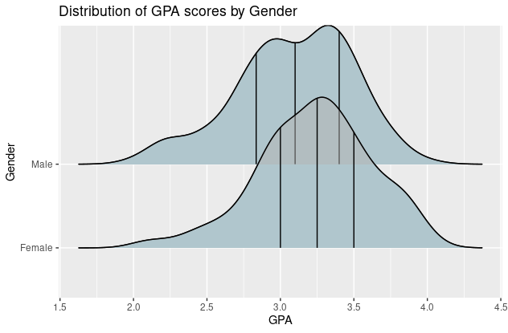

 
Ridgeline plots are partially overlapping line plots that create the impression of a mountain range. They can be quite useful for visualizing changes in distributions over time or space.


The ggridges package provides two main geoms, "geom_ridgeline" and "geom_density_ridges". Using "geom_ridgeline", we can compare quantitative variable and quantitative variable; Using "geom_density_ridges", we can compare a quantitative variable and a categorical variable with multiple density ridges with filled areas.
 
------------------------ 

#### Basic Graphing

```{r echo=FALSE, out.width='100%'}

```

------------------------ 

##### Add quantile lines

With our density ridges, we can also include quantile lines on the plots. Since the graphs overlap, we can also change the opacity of the graphs by changing the alpha value. Both of these changes will be made using the stat_density_ridges function.

```{r echo=FALSE, out.width='100%'}

```

------------------------ 

#### More fancy functions


```{r echo=FALSE, out.width='100%'}

```
Heatmap


```{r echo=FALSE, out.width='100%'}

```
Split into two parts
