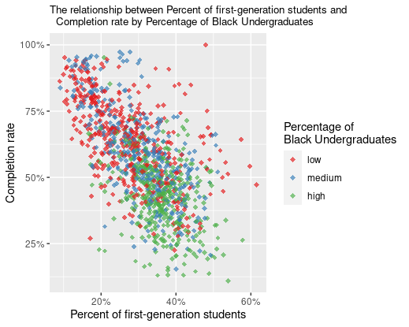
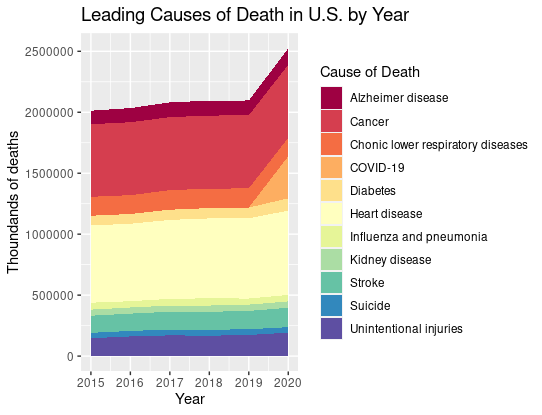

 
```{r echo=FALSE, out.width='100%'}

```

This graph describes the relationship between Percent of first-generation students and Completion rate by Percentage of Black Undergraduates.
  
We can see that for the low percent of undergraduates who report being black, the relationship between the percentage of first-generation students and the completion rate for a university is moderate negative; For the medium percent of undergraduates who report being black, the relationship between the percentage of first-generation students and the completion rate for a university is also moderate negative; For the high percent of undergraduates who report being black, the relationship between the percentage of first-generation students and the completion rate for a university is negative and weak. 


-------------------------------------------

```{r echo=FALSE, out.width='100%'}

```

This graph shows the Leading Causes of Death in U.S. by Year. 

We can see that Alzheimer Disease and Cancer always cause the most deaths. For COVID-19, it appeared and caused a lot of deaths only in 2019 and 2020 since it happened since 2019. 
