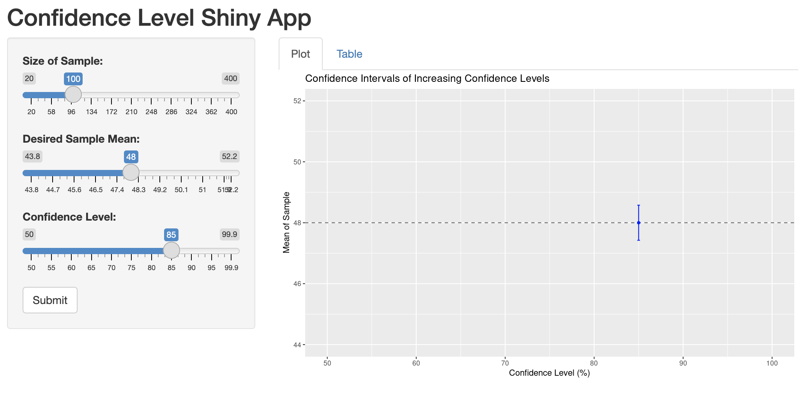
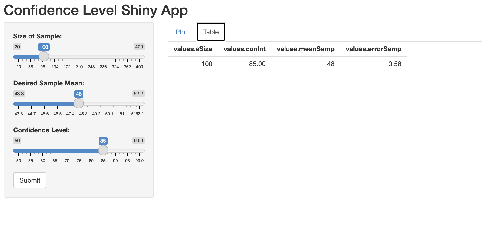

The relationship between the confidence level and the width of the confidence interval is shown in this Shiny App.

There are two parts: **PLOT** and **TABLE**.
For the plot, as confidence level increases, the width of the confidence interval also increases. So we are more confident that the true population mean (depicted by the dashed line) will be contained in the interval. 

And when the confidence interval captures the true mean, it will become blue; but when it does not, it will become orange. 


```{r echo=FALSE, out.width='100%'}

```

--------------------------------

The table records the data of sample size, confidence level, sample mean, and sample error we try each time by controlling the inputs in the sidebar and submit them.

```{r echo=FALSE, out.width='100%'}

```

--------------------------------

**Please click on the "Shiny" button on the left side to take a look at my Confidence Level Shiny App 😊**
